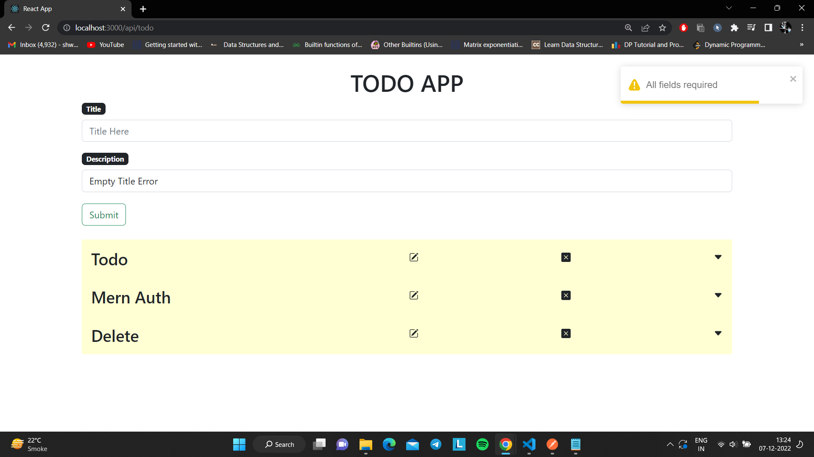
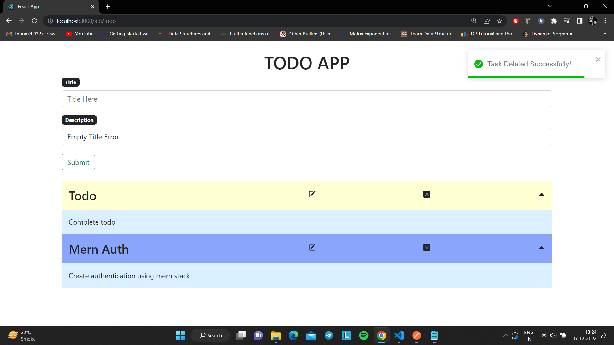

# MERN Stack TODO App

The MERN (MongoDB, Express, React, Node) stack TODO app is a simple yet powerful task management tool that allows you to organize and keep track of your tasks effectively. It offers a user-friendly interface for creating, managing, and prioritizing tasks, making it an ideal choice for personal and professional task management.

## Features

- Create Tasks:

  1) Click the "Add Task" button to create a new task.
  2) Provide a title and description for the task.
  3) Click "Save" to add the task to your list.

- View Tasks:

  1) On the homepage, you can see a list of all your tasks.
  2) Each task displays its title, description, and status (completed or not).

- Edit Tasks:

  1) To edit a task, click the "Edit" button on the task card.
  2) Update the task's title, description, or mark it as completed.
  3) Click "Save" to save your changes.

- Delete Tasks:

  1) If a task is no longer needed, click the "Delete" button to remove it from the list.

## Tools & Technologies Used

- 
- 
- 
- 
- 

## Screenshots

